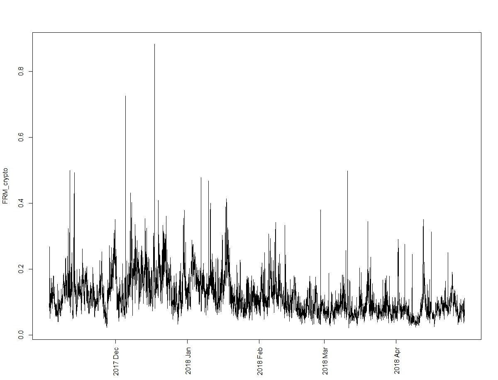

[](http://quantlet.de/)

## [](http://quantlet.de/) **FRM_5_Modeling** [](http://quantlet.de/)

```yaml

Name of QuantLet:     'FRM_5_Modeling'


Published in:         'DEDA_Class_2019WS'


Description:          'Retrieval of FRM Crypto as well as the quantile regression coefficients based on the returns of the   

                      12 coins and 2 macro-economic variables with window size 48,  using quantile LASSO regression and  
                      
                      GACV method provided in the conventional FRM model. Moreover, transform the retrieved coefficients file
                      
                      into a row-wise daily coefficient matrix, based on which we will create a moving network plot in section 8.'


Keywords:             quantile LASSO, GACV, FRM Crypto, regularization parameter, quantile regression coefficient, plotting


Author:               Qi Wu, Seokhee Moon


See also:             'https://github.com/QuantLet/FRM/tree/master/FRM_lambda_series
                       http://frm.wiwi.hu-berlin.de/'


Submitted:            Sun, December 08 2019 by Qi Wu, Seokhee Moon


input:                '1718hourlyReturn_withZEC.csv, macro1718_return.csv'


Output:               'lambdas.csv, coefficient matrix.csv, FRM_Crypto.jpeg'

```



### R Code
```r

# install.packages("quantreg")
setwd("~/HU/WiSe1920/Digital Economy and Data Analysis/project")

library(quantreg)

source("FRM_qrL1.r")
# https://github.com/QuantLet/FRM/blob/master/FRM_lambda_series/FRM_qrL1.r


source("quantilelasso.r")
# https://github.com/QuantLet/FRM/blob/master/FRM_lambda_series/quantilelasso.r


# variables


# read the data
data <- read.csv(file = '1718hourlyReturn_withZEC.csv')
macro <- read.csv(file = 'macro1718_return.csv')


# generate a data matrix with standardized return
xx0 <- data[,-1]
xx0 <- scale(xx0) 


# generate a data matrix with standardized macroeconomic variables
m <- macro[,-1]
m <- scale(m)


# start the linear quantile lasso estimation for each coins


for (k in 1:ncol(xx0)) {
  
  
  cat("Coin:", k, "\n")
  
  
  # log return of firm k
  
  
  y              = as.matrix(xx0[, k])
  
  
  # log returns of firms except firm k
  
  
  xx1            = as.matrix(xx0[, -k]) 
  
  
  # number of rows of log return
  
  
  n              = nrow(xx1)
  
  
  # number of covariates
  
  
  p              = ncol(xx1) + ncol(m)
  
  
  # quantile level
  
  
  tau            = 0.05
  
  
  # window size
  
  
  ws             = 48 
  # also try the ws = 24 and compare
  
  
  
  # lambda calculated from linear quantile lasso
  
  
  lambda_l       = matrix(0, (n - ws), 1)
  beta_l       = matrix(0, (n - ws), p)
  
  
  # start the moving window estimation
  
  
  for (i in 1:(n - ws)) {
    
    
    cat("time:",i,"\n")
    
    
    yw  = y[i:(i + ws)]
    
    
    mw  = m[i:(i + ws), ]
    
    
    xx          = xx1[i:(i + ws), ]
    
    
    # all the independent variables
    
    
    xxw         = cbind(xx, mw)
    
    
    fit         = linear(yw, xxw, tau, i, k)
    
    
    lambda_l[i] = fit$lambda.in
    
    beta_l[i,] = fit$beta.in
    
    cat("lambda:",lambda_l[i],"\n")
    cat("beta:",beta_l[i,],"\n")
    
    
  }
  
  
  write.csv(lambda_l, file = paste("lambda_l_", k, ".csv", sep = ""))
  write.csv(beta_l, file = paste("beta_l_", k, ".csv", sep = ""))
  
} 


# calculate the average of 12 lambda series

full.lambda = matrix(0, nrow(xx0)-ws, ncol(xx0))


for (j in (1:ncol(xx0))) {
  
  
  lambda.firm      = read.csv(file = paste("lambda_l_", j, ".csv", sep = ""))
  
  
  full.lambda[, j] = as.matrix(lambda.firm)[, 2]
  
  
}


# FRM based on 12 coins


average_lambda = 1/ncol(xx0) * (rowSums(full.lambda))
date = data$time[(ws+1):length(data$time)]

lambdas = data.frame('time' = date, 'FRM' = average_lambda)
write.csv(lambdas, 'lambdas.csv', row.names = FALSE)


# plot the FRM Crypto

xtick = match(c("12/1/2017 12:00", "1/1/2018 12:00",
                "2/1/2018 12:00", "3/1/2018 12:00", "4/1/2018 12:00"),
              data$time) - ws
plot(average_lambda, type = 'l', xaxt = 'n', xlab = ' ', ylab = 'FRM_crypto')
axis(side = 1, at = xtick, labels = c('2017 Dec', '2018 Jan',
                                      '2018 Feb', '2018 Mar', '2018 Apr'), las = 2)
legend('topright', legend='FRM', col='black',
       lty=1, cex=0.8)


# create the beta matrix

full.beta = matrix(0, nrow(xx0)-ws, ncol(xx0)*13)


for (j in (1:ncol(xx0))) {
  
  
  beta.coin      = read.csv(file = paste("beta_l_", j, ".csv", sep = ""))
  
  
  full.beta[, (13*j -12):(13*j)] = as.matrix(beta.coin)[, -1]
  
  
}
length(data$time[-(1:ws)])
beta.df = as.data.frame(full.beta)
beta.df = cbind(data$time[-(1:ws)], beta.df)
colnames(beta.df)[1] = 'time'


# rearrange the beta matrix into a coefficient matrix where the every-hour coefficient matrix
# are row wise concatenated

beta.df = as.matrix(beta.df[,-1])
CoefMat = matrix(nrow = ncol(xx0))
for (i in 1:dim(beta.df)[1]){
  dayCoefMat = matrix(nrow = ncol(xx0), ncol = ncol(xx0)+2)
  
  for (j in 1:ncol(xx0)){
    coef.coin = beta.df[i, (13*j-12):(13*j)]
    coef.coin = append(coef.coin, 0, after = j-1)
    dayCoefMat[j,] = as.vector(coef.coin)
  }
  CoefMat = cbind(CoefMat, dayCoefMat)
}

CoefMat = CoefMat[, -1]

write.csv(CoefMat, 'coefficient matrix.csv', row.names = FALSE)

```

automatically created on 2020-01-31